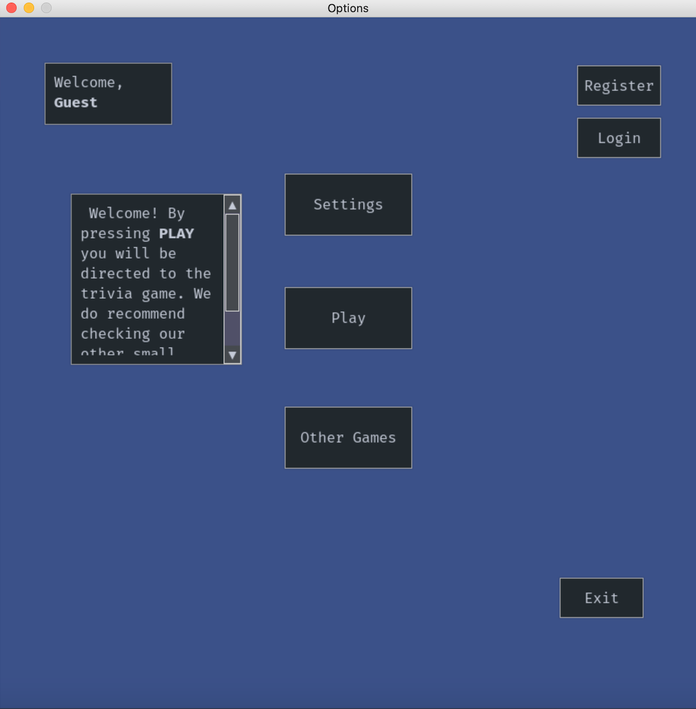
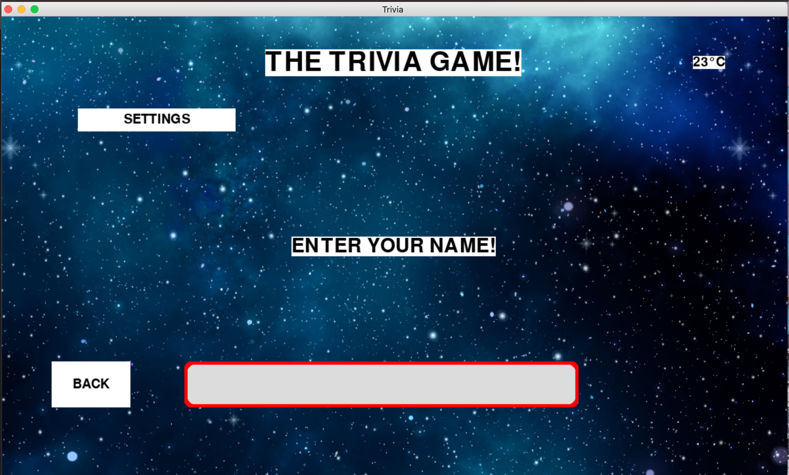
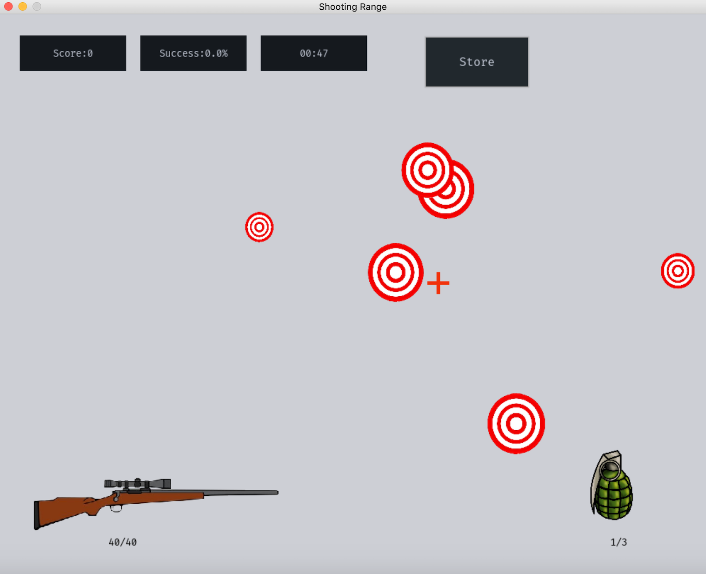
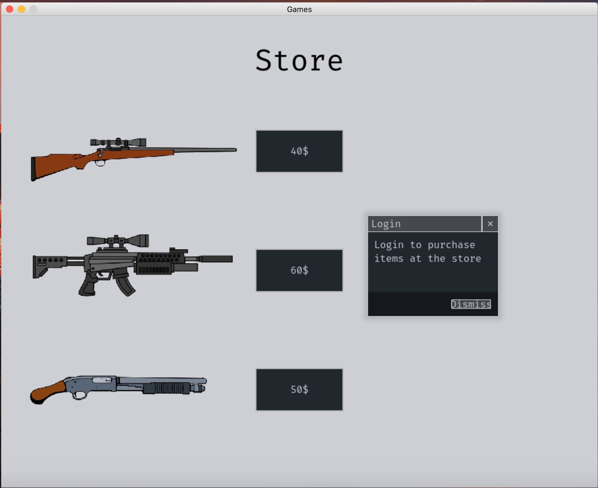
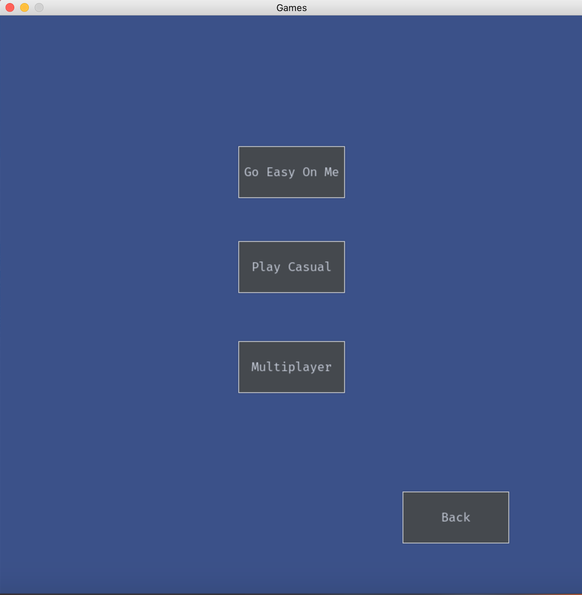
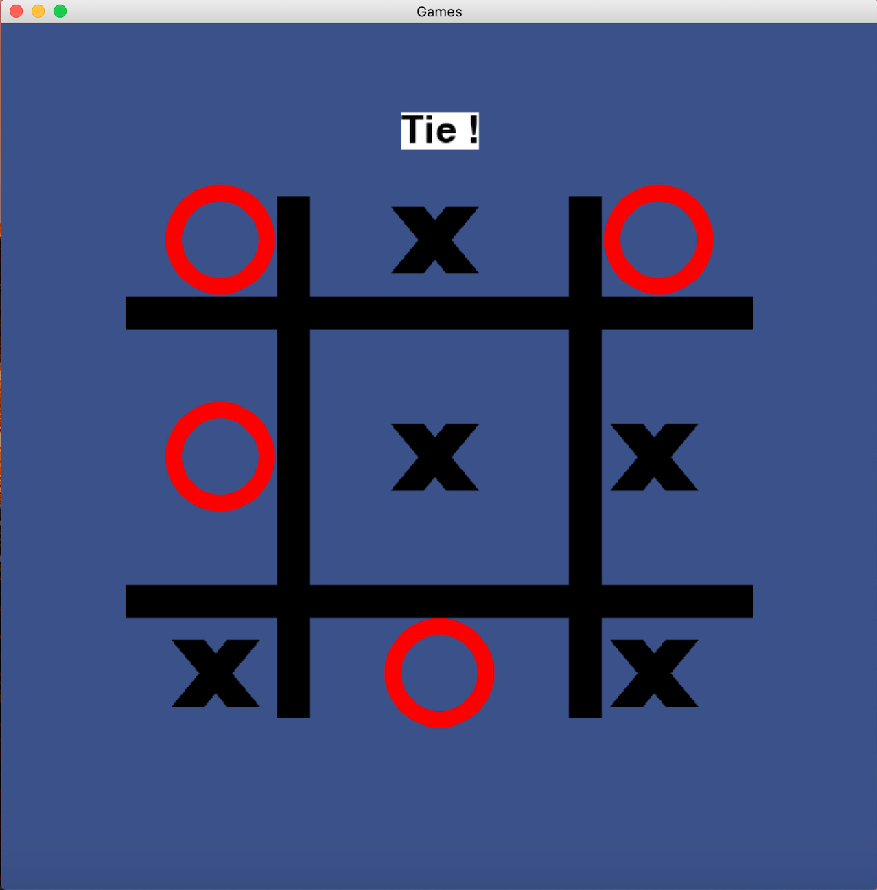
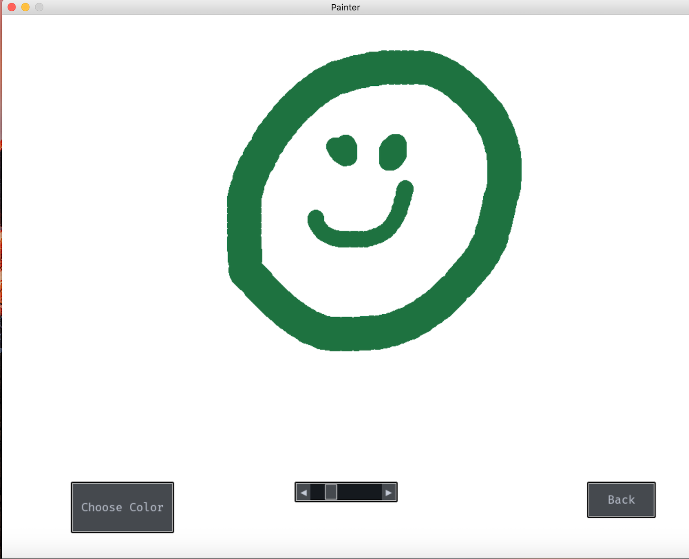
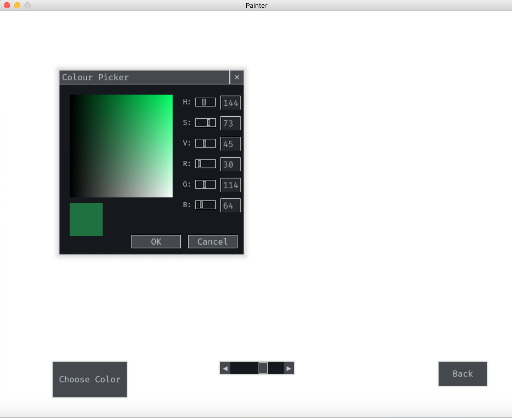

# GamesWizard

<small>A collection of simple games created in Python and Pygame.</small>

<h2>Trivia</h2>

Think you're good enough for our trivia questions? Think again.
Even if we don't manage to solve them! But be careful... you only have 3 strikes.  

<h2>Target Shooter v1.0</h2>

It's time to test these reflexes of yours. You have only one minute to hit as many targets as possible before they escape your sight or you're out of ammo.

If you've already created an account, you can also purchase new guns from the store. 

<h2> Tic Tac Toe</h2>

The great old classic game that can never die. You can test yourself against the computer in several difficulty levels
or play with others in your local area network.

You can  choose your favorite playing mode: 

And then play against the computer or others.

<h2>Painter</h2>
<small>Who doesn't like a simple old painter? </small>

You can also change colors via a color picker: 

